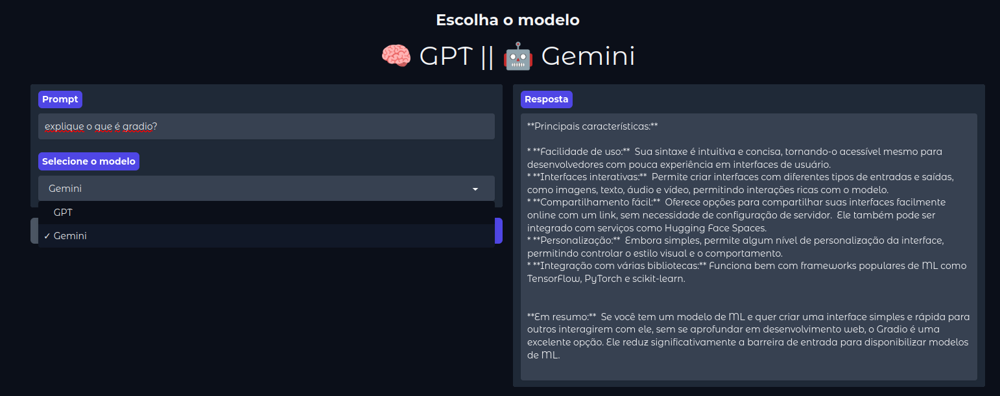

    <a href="https://github.com/carineconstantino/hackingbr">@hackingbr></a>

## 👾 2Prompt
### 🇧🇷
Web app em Python3 e Gradio que faz a integração dos modelos GPT4 Mini e o Gemini Flash. Escolha o modelo para sua resposta (requer API). 

    

#
