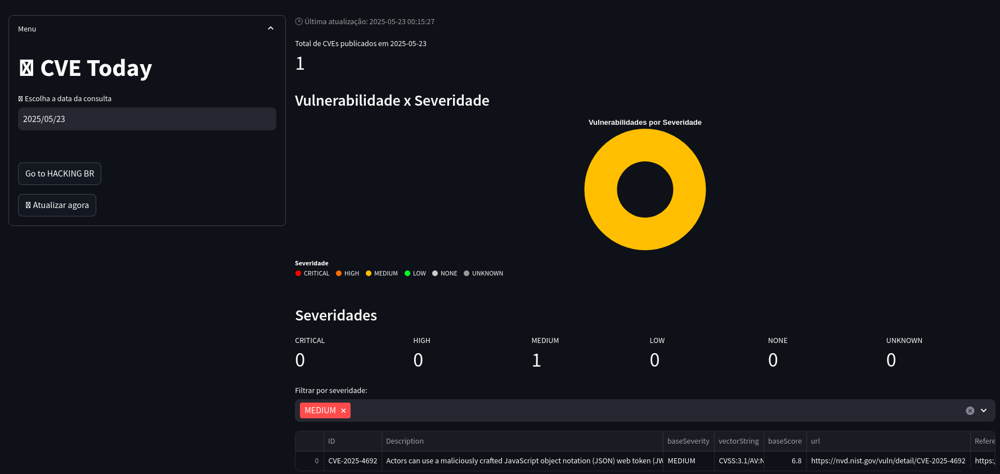

    <a href="https://github.com/carineconstantino/hackingbr">@hackingbr></a>

## 👾 CVE Today
### 🇧🇷

Usando a API pública do NIST NVD, o web app CVE Today é uma ferramenta para buscas e monitoramento de novas CVEs.

Diariamente são publicadas novas vulnerabilidades, e manter-se atualizado é essencial.

Usando Python3 e o Streamlit, o CVE Today tem a proposta de apoiar profissionais de segurança cibernética de forma simples e direta, sem substituir outras tantas bases disponíveis, mas com o proposito de trazer rapidez e simplicidade na consulta por novas vulnerabilidades.
 

    

#
