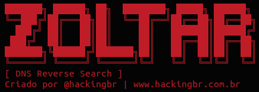
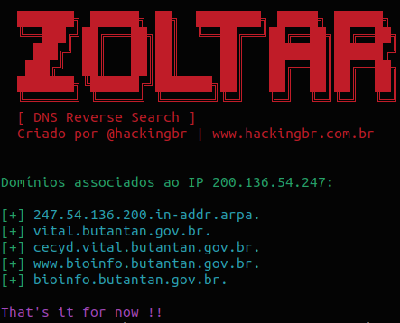

<p align="left">
    <p></p>
    <a href="https://github.com/carineconstantino/hackingbr">@hackingbr></a>
</p>

## 👾 Zoltar
### 🇧🇷
Zoltar é uma ferramenta em Python3, que faz uma enumeração de domínios associados a um IP usando a consulta DNS reversa.

### 🇺🇸
Zoltar tool make a domain enumeration from a IP address by searching a reverse DNS registers.


## ⏩ Exemplo
```
python3 zoltar.py -ip [IP]
```
### 🎯 Resultado na CLI

<p align="left">
    <p></p>
</p>

## 👾 Zoltar
O nome Zoltar é uma referência ao filme "Big" de 1988, onde em um parque de diversões existe a máquina que realiza desejos chamada Zoltar. Filmes dos anos 80/90 fizeram parte da minha vida, e essa é minha homenagem a essa época fascinante do cinema. 
<p align="left">
<p></p>
</p>
#

