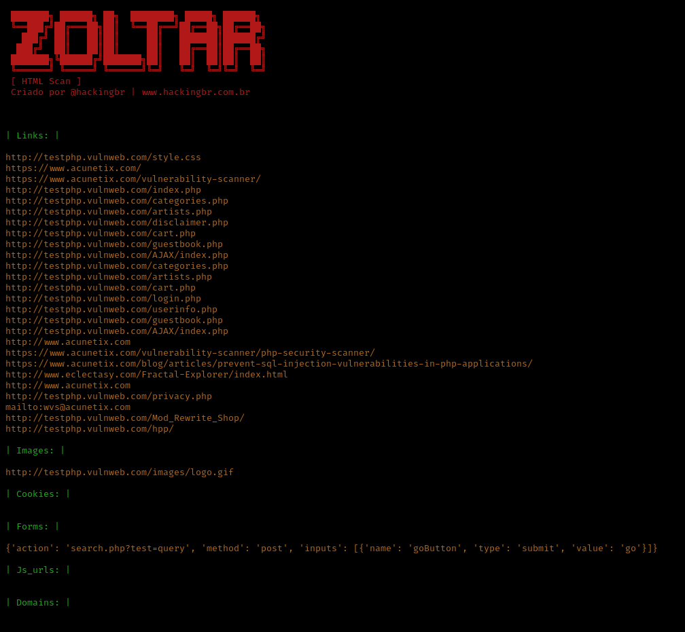
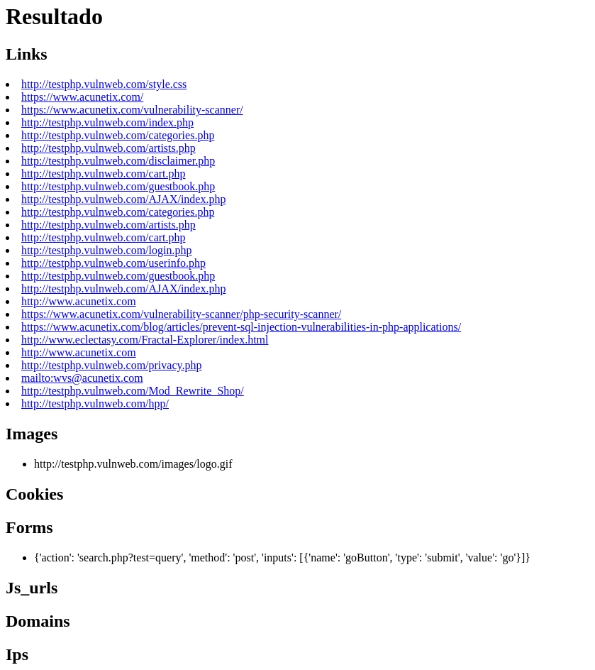

<p align="left">
    <p></p>
    <a href="https://github.com/carineconstantino/hackingbr">@hackingbr></a>
</p>

## 👾 Zoltar [HTML Scan]
### 🇧🇷
Zoltar é uma ferramenta em Python3 que analisa os códigos HTML e Javascript de uma página web capturando links, diretórios, credenciais, cookies e o local storage, campos de formulário, domínios, endereço IP. Ao final do scan é gerado um relatório simples em HTML. 

## ⏩ Exemplo
```
python3 zoltar-html-scan.py -ip [IP]
```
### 🎯 Resultado na CLI

<p align="left">
    <p></p>
</p>
<p align="left">
    <p></p>
</p>

#


