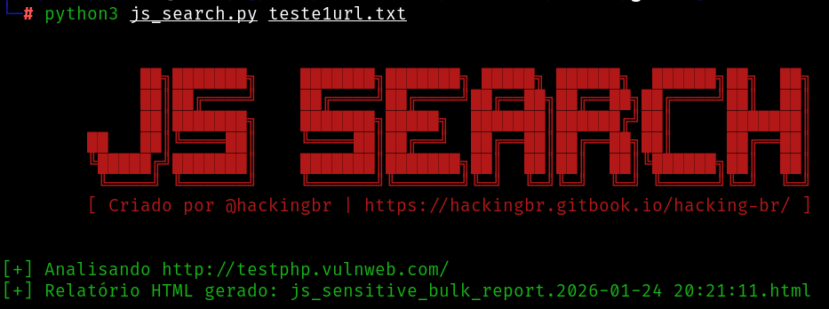
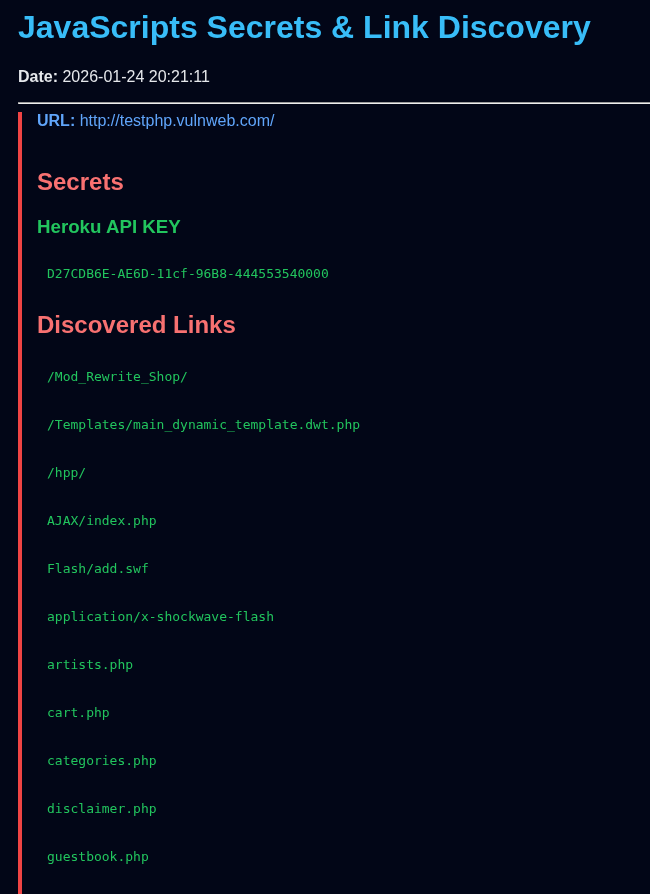

<p align="left">
    <p></p>
    <a href="https://hackingbr.gitbook.io/hacking-br/">@hackingbr</a>
</p>

## 👾 JS Search
### 🇧🇷
Ferramenta em Python3 que analisa busca em arquivos Javascripts por informação relevante.

Items procurados: 

- Links
- URLs
- Chaves de API
- Secrets
- Token de acesso
- Chaves privadas de certificado
- Credenciais

## ⏩ Exemplo
```
python3 js_search.py [arquivo]
```
### 🎯 Resultado na CLI

<p align="left">
    <p></p>
</p>
<p align="left">
    <p></p>
</p>

#
