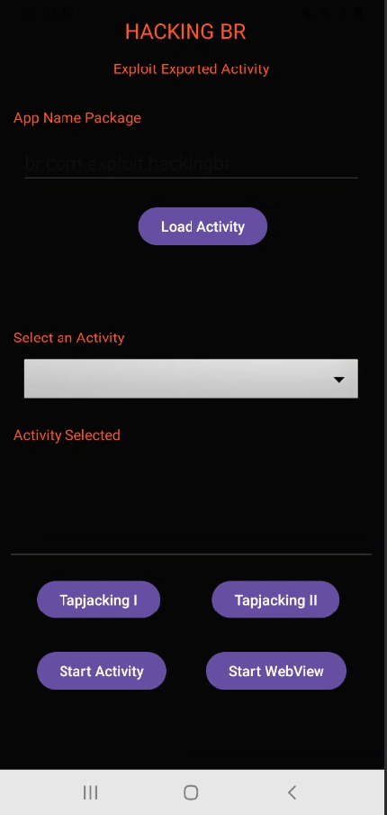

    <a href="https://github.com/carineconstantino/hackingbr">@hackingbr></a>

## 👾 Exploit Exported Activity
### 🇧🇷
Exploit Activity é um aplicativo que lista as Activities exportáveis de outro aplicativo, a partir do nome do pacote informado. 
O objetivo do aplicativo é acessar a tela da Activity desprotegida de outro aplicativo. 

### 🇺🇸
Exploit Exported Activity is a app that list exported Activities from another app by a package name setting. 
The main goat is to access insecure Activities from another application. 

## :bulb: Download
Faça o download do arquivo .apk neste [LINK](https://github.com/carineconstantino/hacking_br/blob/main/Mobile/Android/Exploit-Exported-Activity/app-release.apk)

- [x] Release - v3 - 10-Setembro-2024
+ Novas funções:
  - [x] Tapjacking I (Toast)
  - [x] Tapjacking II (System Alert Windows)
  - [x] Start WebView (PoC com Aplicativo Vuln WebView)
  
- ~~Release - v2 - 30-Agosto-2024~~
- ~~Release - v1 - Agosto/2024~~

## ⏩ Exemplo

- Informe o nome do pacote do aplicativo-alvo e clique em "Load Activities"
- Selecione a Activity que deseja acessar e clique na ação que deseja executar

    

#

