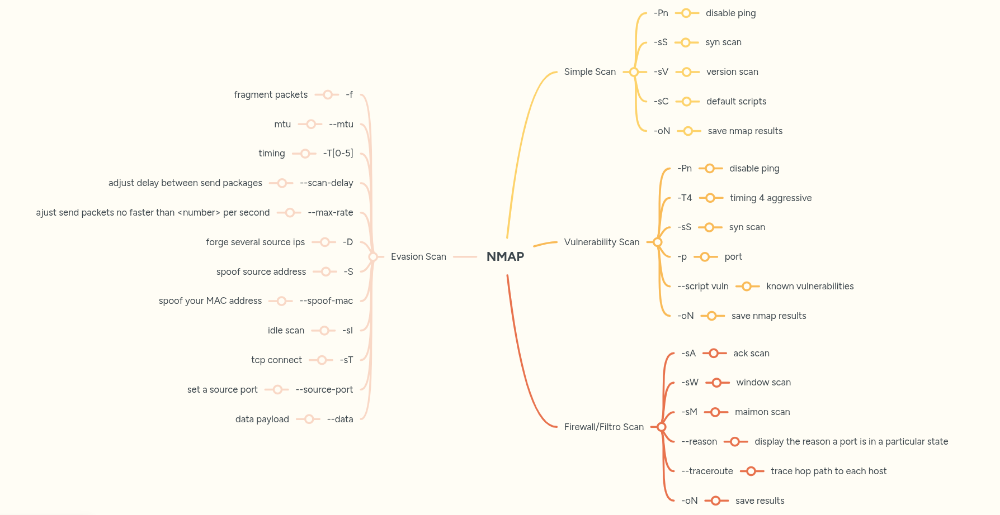

<p align="left">
    <a href="https://github.com/carineconstantino/hackingbr">@hackingbr></a>
</p>

## 👾 NMAP [Ultimate Guide]

### Simple Scan
<p> Faça o primeiro scan com pacotes SYN, detecção da versão dos serviços e os scripts padrão.
O pacote SYN não completa a conexão com o host, a avaliação do estado da porta ocorre da seguinte forma:</p>

* resposta do host com SYN-ACK = posta aberta
* resposta do host com RST = porta fechada
* sem resposta ou ICMP unreachable = porta bloqueada/filtrada pelo firewall

```
nmap -Pn -sS -sV -sC [IP] -oN [file].txt
```
* -Pn = disable ping
* -sS = syn scan
* -sV = version scan
* -sC = default scripts
* -oN = save nmap results

### Vulnerability Scan
<p> 
- -Pn = disable ping
- -T4 = timing 4 aggressive


## ⏩ Exemplo
```
python3 zoltar-dns-reverse-search.py -ip [IP]
```
### 🎯 Resultado na CLI

<p align="left">
    <p></p>
</p>

#
