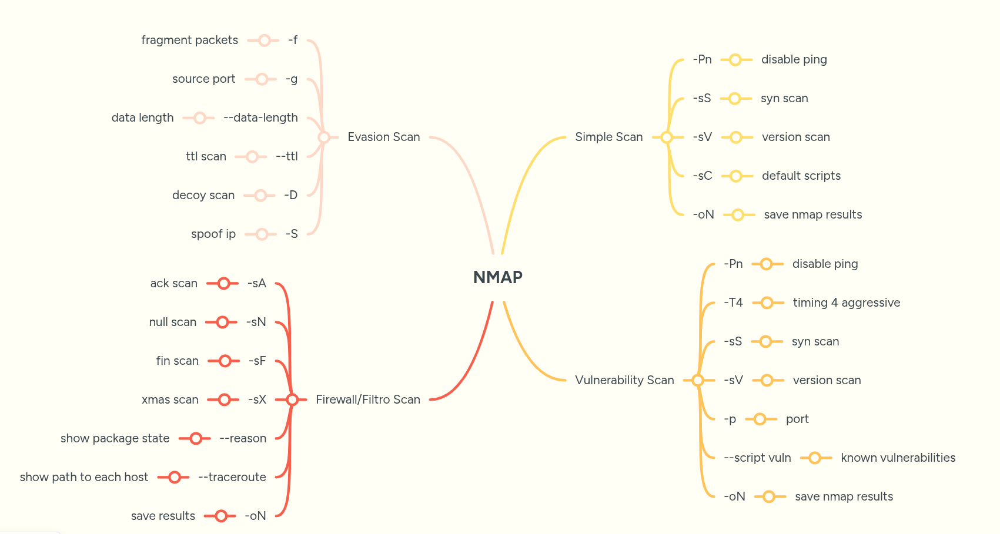

<p align="left">
    <a href="https://github.com/carineconstantino/hackingbr">@hackingbr></a>
</p>

## NMAP [Ultimate Guide]

## TCP SYN (Stealth) Scan (-sS)
<p>O SYN scan funciona iniciando a conexão com um pacote SYN, como no início do handshake TCP. Se a porta estiver aberta, o alvo responde com SYN/ACK, mas o Nmap não finaliza a conexão (não envia ACK). Em vez disso, um pacote RST é enviado para encerrar a comunicação.</p>

* resposta do host com SYN-ACK = porta aberta
* resposta do host com RST = porta fechada
* sem resposta ou ICMP unreachable = porta bloqueada/filtrada pelo firewall

```
nmap -Pn -sS -sV -sC [IP] -oN [file]
```
* -Pn = disable ping
* -sS = syn scan
* -sV = version scan
* -sC = default scripts
* -oN = save nmap results

Ref.: [SYN Scan](https://nmap.org/book/synscan.html)

## Vulnerability Scan
<p>Scripts na categoria VULN verificam algumas vulnerabilidades conhecidas.</p>

```
nmap -Pn -T4 -sS -sV -p [PORT] --script vuln [IP] -oN [file]
```

* -Pn = disable ping
* -T4 = timing 4 aggressive
* -sS = syn scan
* -sV = version scan
* -p = port
* --script vuln
* -oN = save nmap results

Scan automático Simples + Vulnerabilidade [nmap.sh](https://github.com/carineconstantino/hacking_br/blob/main/NMAP-Ultimate-Guide/nmap.sh)

## Firewall/Filtro Scan
<p>Scan para validar regras e filtros de firewall na rede</p>

### ACK Scan 
<p>O ACK scan (ativado com -sA) é usado para mapear regras de firewall, e não identifica se portas TCP estão abertas. Esse scan envia pacotes com a flag ACK. Se o alvo responder com RST, a porta é considerada não filtrada. Se não houver resposta ou vier uma mensagem de erro ICMP, a porta é marcada como filtrada.</p> 

```
nmap -sA --reason --traceroute [IP] -oN [file]
```

### NULL Scan
<p>Null scan envia pacotes com a flag TCP marcada como zero, e o alvo não sabe como responder. O pacote é descartado pelo alvo, indicando que a porta está aberta.</p> 
<p>De acordo com a RFC 793:</p>

* Se o pacote for enviado para uma porta fechada, o host deve responder com um RST (Reset)
* Se o pacote for enviado para uma porta aberta, o host deve ignorar o pacote e não responder

<p>A falta de resposta não permite afirmar com certeza se a porta está "aberta", por isso o Nmap classifica como open|filtered.</p> 

```
nmap -sN --reason --traceroute [IP] -oN [file]
```

### FIN Scan
<p>A flag FIN no TCP é usada para encerrar uma conexão já estabelecida. No scan com o parâmetro -sF, o Nmap envia um pacote FIN para uma porta sem uma conexão prévia,  quebrando o comportamento esperado do protocolo TCP.</p>
<p>Segundo a RFC 793 (TCP):</p>

* Se a porta estiver fechada, o host deve responder com um RST (Reset).
* Se a porta estiver aberta, não deve haver resposta alguma.</p>

```
nmap -sF --reason --traceroute [IP] -oN [file]
```

## XMAS Scan
<p>Xmas scan habilita as flags PSH, FIN e URG no header do pacote TCP. Se a porta estiver "open", nenhuma resposta será enviada. O reset na reposta do alvo indica que a porta está fechada.</p>

```
nmap -sX--reason --traceroute [IP] -oN [file]
```

* -sX = Xmas scan
* --reason = show package state
* --traceroute = show path to each host
* -oN = save nmap results

<p>PSH (Push Function) = Indica que os dados devem ser entregues imediatamente à aplicação receptora, sem esperar que o buffer seja preenchido. Ao receber um segmento com a flag PSH, o pacote TCP no alvo envia os dados imediatamente para a aplicação, em vez de esperar por mais dados para formar um bloco maior.</p>
<p>URG (Urgent) = Indica que o pacote é urgente. O campo "User Pointer" é definido para indicar a urgência no envio do pacote e a quantidade de dados transmitida.  O TCP envia imediatamente os pacotes para a aplicação.</p>

Scan automático Firewall/Filtro [firewall-check.sh](https://github.com/carineconstantino/hacking_br/blob/main/NMAP-Ultimate-Guide/firewall-check.sh)

## Evasion Scan
<p>Scan para fazer evasão de filrewall/IDS/IPS</p>

```
nmap -f -g [PORT] --data-length [VALOR] --ttl [VALOR] -D [IP1, IP2]/RND:5 -S [ip1, ip2...ipN] [IP-ALVO]
```

* -f = os pacotes são divididos em tamanho menores
* -g = define uma porta de origem
* --data-length = gera pacotes com o campo data modificado
* --ttl = configura TTL customizado para o pacote
* -D = configura IPs de origem de forma randômica (RND:5 -gera 5 IPs randômicos)
* -S =  Spoof IP address


Scan automático Evasion [firewall-evasion.sh](https://github.com/carineconstantino/hacking_br/blob/main/NMAP-Ultimate-Guide/firewall-evasion.sh)

<p align="left">
    <p></p>
</p>

#
