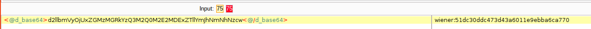
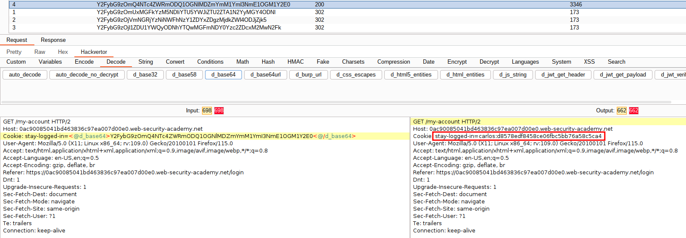
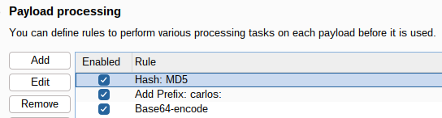

# Session Token Brute-force

:fries:Checklist
- verifique se o token que gerencia a sessão é randômico ou estático
- verifique o tipo de "encode" usado

<p>:bulb: Sequencer in Burp Suite: use essa ferramenta para analisar "session tokens", e outros.</p>
<p>:bulb: Hackvertor in Burp Suite: use essa ferramenta para facilmente aplicar o decode.</p> 

<p>No lab do Portswigger neste <a href="https://portswigger.net/web-security/authentication/other-mechanisms/lab-brute-forcing-a-stay-logged-in-cookie">link</a> é feito um brute-force no token de sessão da aplicação. 
A função "Stay logger in" ("Lembrar-me") quando marcada, adiciona um token de sessão no Cookie. Ao analisar o token com a ferramenta Hackvertor, observamos ao fazer o "decode", que o token revela o usuário e o hash da senha.</p>



Para validar se o hash é realmente a senha, usamos o comando: 
```echo -n 'peter' | md5sum```

<p>Ao remover todos os cookies da requisição e manter apenas o "stay-logged-in", observamos que a sessão é mantida, isso ocorre pois é o cookie "stay-logged-in"  que mantém o usuário autenticado. A partir dessa validação, podemos executar um brute-force no valor deste cookie.</p>
A configuração do Intruder é a seguinte: 

- Payload processing
   - Hash: MD5 para a senha 
   - Add Prefix: carlos - neste cenário o usuário válido é conhecido
   - Base64-encode




Na imagem podemos ver que o tamanho da resposta e o "status code" revelam a requisição com a senha correta. 
