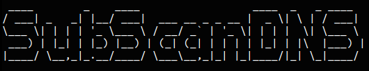
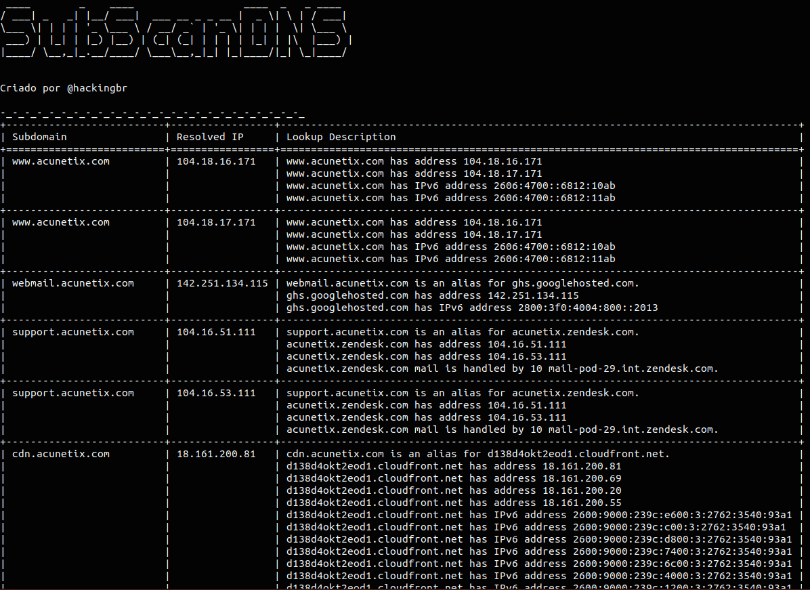

<p align="left">
    <p></p>
    <a href="https://github.com/carineconstantino/hackingbr">@hackingbr></a>
</p>

## 👾 SubScanDNS
### 🇧🇷
SubScanDNS é uma ferramenta em Python3, que faz uma enumeração de subdomínios usando a resolução DNS, a partir de uma wordlist.
Para cada subdomínio encontrado, a ferramenta retorna os endereços IPs associados no processo de Lookup. 
O resultado é salvo no formato HTML e também na CLI padrão. 

### 🇺🇸
SubScanDNS tool make a subdomain enumeration from a custom wordlist by DNS resolution, discovering IP address from each subdomain found.
Results are save in HTML format and CLI output. 

## ⏩ Exemplo
```
python3 SubScanDNS.py -domain exemplo.com
```
### 🎯 Resultado na CLI

<p align="left">
    <p></p>
</p>

### 🎯 Resultado no formato HTML

<p align="left">
    <p></p>
</p>

#
