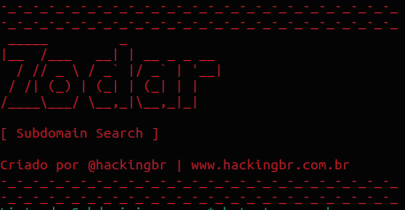

<p align="left">
    <p></p>
    <a href="https://github.com/carineconstantino/hackingbr">@hackingbr></a>
</p>

## 👾 Zodar
### 🇧🇷
Zodar é uma ferramenta em Python3, que faz uma enumeração de subdomínios usando a resolução DNS.

### 🇺🇸
Zodar tool make a subdomain enumeration by DNS resolve.


## ⏩ Exemplo
```
python3 zodar.py -domain [domain]
```
### 🎯 Resultado na CLI

<p align="left">
    <p></p>
</p>

#

