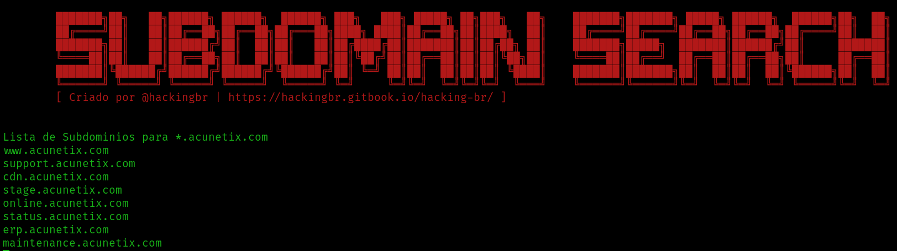

<p align="left">
    <p></p>
    <a href="https://hackingbr.gitbook.io/hacking-br/">@hackingbr</a>
</p>

## 👾 Subdomain Search
### 🇧🇷
Ferramenta em Python3 para descoberta de subdomínios usando resolução DNS.
Diferente de outras ferramentas, Subdomain Search o módulo "build-in" do python para descobrir subdomínios, sem a necessidade de usar API de terceiros. 

## ⏩ Exemplo
```
python3 subdomain-search.py -domain [domain]
```
### 🎯 Resultado na CLI

<p align="left">
    <p></p>
</p>

#


