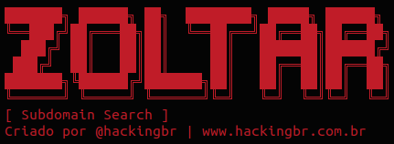
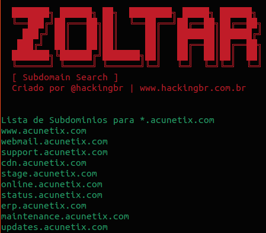

<p align="left">
    <p></p>
    <a href="https://github.com/carineconstantino/hackingbr">@hackingbr></a>
</p>

## 👾 Zoltar [Subdomain Search]
### 🇧🇷
Zoltar é uma ferramenta em Python3 que faz uma enumeração de subdomínios usando a resolução DNS.
Diferente de outras ferramentas, Zoltar usa ferramenta "build-in" para descobrir subdomínios, sem a necessidade de usar API de terceiros. 

### 🇺🇸
Zoltar tool make a subdomain enumeration by DNS resolve.
Different from other tools, Zoltar uses "build-in" tool to discover subdomains, and dont need third party API. 


## ⏩ Exemplo
```
python3 zoltar-subdomain-search.py -domain [domain]
```
### 🎯 Resultado na CLI

<p align="left">
    <p></p>
</p>

#


