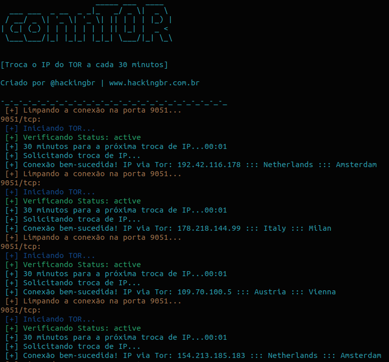

<p align="left">
    <p></p>
    <a href="https://github.com/carineconstantino/hackingbr">@hackingbr></a>
</p>

## 👾 connTOR
### 🇧🇷
connTOR é uma ferramenta em Python3, que muda o IP da conexão TOR a cada 30 minutos. 

A proposta da ferramenta não é ser uma solução definitiva para bloqueios durante um pentest, mas uma alternativa automática para trocar o IP da conexão e, em alguns cenários, evitar o bloqueio por ferramentas como firewall de aplicação (WAF). O uso da ferramenta para simulação de "brute-force" requer também a configuração de tempo e quantidade de requisição na simulação desse ataque e de outros que fazem o envio de grande quantidade de requisição. O ajuste se faz necessário devido ao método usado pela ferramenta para trocar o IP, ou seja, na troca do IP, a conexão é interrompida e restabelecida em seguida e, portanto, o "brute-force" deve ter uma configuração com os mesmos 30 minutos da ferramenta. 

## ⏩ Exemplo
```
python3 connTOR.py
```
### 🎯 Resultado na CLI

<p align="left">
    <p></p>
</p>
