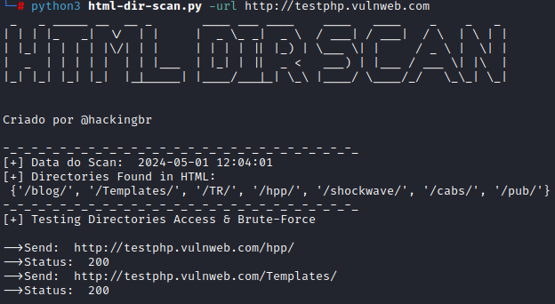
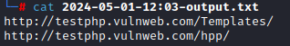

<p align="left">
    <a href="https://github.com/carineconstantino/hackingbr">@hackingbr></a>
</p>

## HTML DIR SCAN TOOL
HTML DIR Scan é uma ferramenta em python que identifica diretórios ("paths") no código HTML de uma página, e em seguida realiza uma enumeração nos diretórios localizados.
O objetivo é validar quais "paths" são acessíveis, e assim descobrir endpoints "escondidos" no site, aumentando a superfície de ataque. O resultado é uma wordlist pronta e personalizada para enumeração de diretórios com ferramentas de Fuzzing. 

## Exemplo
```
python3 html-dir-scan.py -url https://exemplo.com
```
### Resultado na CLI
Diretórios validados
<p align="left">
    <p></p>
</p>

### Wordlist personalizada
URLs validadas salvas em um arquivo .txt para uso em ferramentas de Fuzzing.
<p align="left">
    <p></p>
</p>

#

