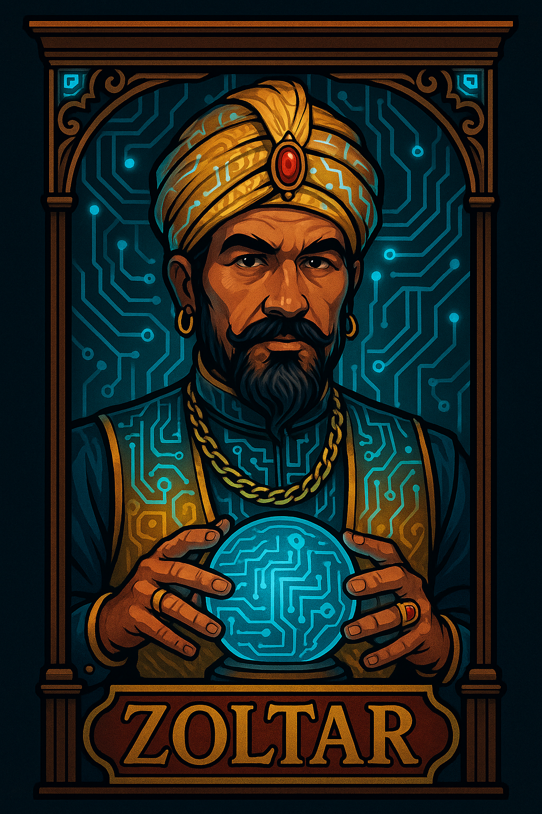

    

    <a href="https://github.com/carineconstantino/hackingbr">@hackingbr></a>

## 👾 Zoltar
O nome Zoltar é uma referência ao filme "Big" de 1988, onde em um parque de diversões existe a máquina que realiza desejos chamada Zoltar. Filmes dos anos 80/90 fizeram parte da minha vida, e essa é minha homenagem a essa época fascinante do cinema. 

### 🇧🇷
Coleção de scripts

### 🇺🇸
Scripts collection

#
